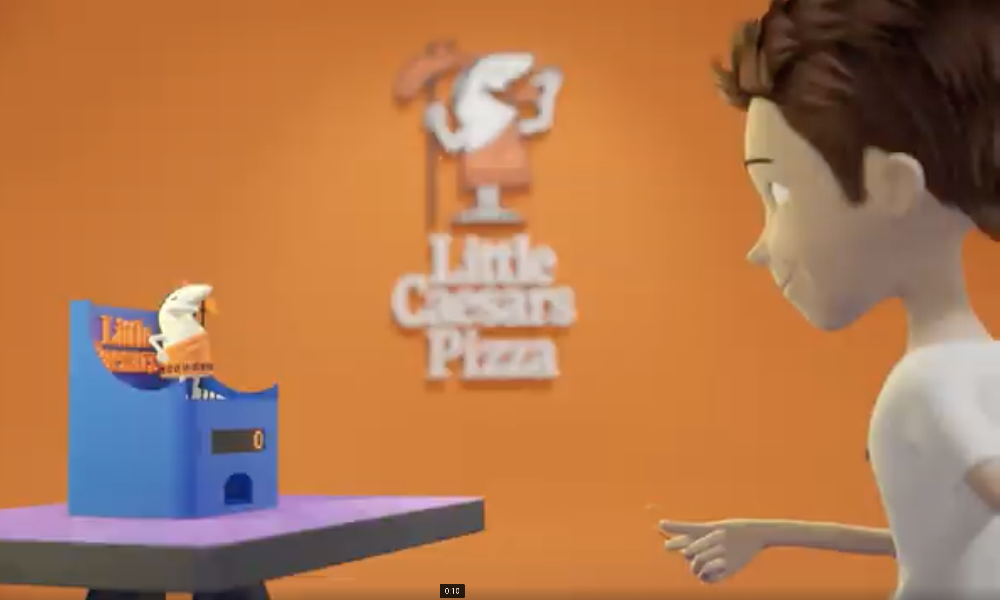

# Electronic Frog Hole

Design your own electronic bean bag with score and sounds to the classic backyard game, featuring reset score button and sometimes even a musical score sound for multi-game fun, perfect for parties, family nights, or carnival-style play with scoring features like automatic point tracking for competitive play. 

### Click on the following image to watch Electronic Bean Bag ideas.

### Dependencies

Guided design to your unique Electronic Bean Bag using the folllowing open sources: 

   * Blender open source 3D design
   * Arduino ATMega 328 compiler 
   * UltiMaker Cura 3D GeoCode

### Installing
Open sorce software requirements links :
* [Blender 3D ](https://www.blender.org/download/)
* [Arduino Compiler](https://www.arduino.cc/en/software )
* [UltiMaker Cura ](https://ultimaker.com/software/ultimaker-cura/#downloads)

### BOM - Bill of Material

| Description  | Quantity | Unit Price     | availale at   |
| :---         |  :---:   |    :---:      |          ---: |
| Arduino Nano ATMEGA 328 | 1 | $5.00          |[Amazon](https://www.amazon.com/sspa/click?ie=UTF8&spc=MTozOTk1Njc4NTI5OTE4MzE5OjE3ODI2NTA5NTM6c3BfYXRmOjIwMDAxNjk1MTgwOTc2MTo6MDo6&url=%2FLAFVIN-Board-ATmega328P-Micro-Controller-Arduino%2Fdp%2FB07G99NNXL%2Fref%3Dsr_1_1_sspa%3Fcrid%3D1Z6Z1IPMD5V83%26dib%3DeyJ2IjoiMSJ9.UR9t6Z2D5rIVJlr8NPSrk2dC_H3-dmg6NCs-PyO1tQoQmxHoK__TnT3AM82OsG8EyVeLIqEnBqbW4ylykqN0iNF0a5sfteB3CgcjDa_-Pq6xxmC9ysaVODKeGivb_E_hm_jzUJfXlE4iSiD252EIYOFKvOg2EawwURsHERstDiwOqAJPUTUU1r2tZrDJC0hesrYRBHxWhqbd1TRunIOVTTZ0vXMa8m0qYe6WISSEjGg.CeOBFbqSqMk5xTeXunqZeH4JczGDn6W4wWcdTaTdKAY%26dib_tag%3Dse%26keywords%3Darduino%2Bnano%2Bat328%2Bold%26qid%3D1782650953%26sprefix%3Darduino%2Bnano%2Bat328%2Bold%252Caps%252C130%26sr%3D8-1-spons%26sp_csd%3Dd2lkZ2V0TmFtZT1zcF9hdGY%26psc%3D1) |
| TCRT 5000 Sensors    | 3| $4.00         |[Amazon](https://www.amazon.com/HiLetgo-Channel-Tracing-Sensor-Detection/dp/B00LZV1V10/ref=sr_1_3?crid=2LA0MIX2BDMEY&dib=eyJ2IjoiMSJ9.a-8jtu41oXDvniKLGtRzBPzEIEfqmKJR0Wj1C42Q2QW2wKA6LfO49hK-z1d5vTVgKcpdVcc7jZOBD1vhzz0Fx9JX4Hw2c8zXNoBtQz8bYwkPqymT_r9oZ6Wap0LNr5z_RMfZ2TVDRjUdjSg-_O9rq_FOK6fjcOQvWRCwdKXFPwVyjPG5Eqh5dG2Mq69eVlEe4k6vmB7-3xsHV8jS-K2hejCEw2Zzej-Pb-kIKAxLWaA.FSUC-OwxHESjmOtkVDwiUcuFZ-4ksOwI-IZyVdvpVvI&dib_tag=se&keywords=TCRT+5000+Sensors&qid=1782651214&sprefix=tcrt+5000+sensors%2Caps%2C134&sr=8-3)    |
| Breadboard   | 1 | $10.30          | [ClayPlugin](https://www.paypal.com/ncp/payment/E228BZ3QNET8E)     |
| PLA Filament | 1| $15.00          | [Amazon](https://www.amazon.com/sspa/click?ie=UTF8&spc=MTo3NjIzNTM5MjgzMTg4NTUwOjE3NjY2NzA1NDg6c3BfYXRmOjMwMDI4Mzc0Nzc2MzAwMjo6MDo6&url=%2FeSUN-Printing-Filament-Printer-Printers%2Fdp%2FB0CS2Q2P25%2Fref%3Dsr_1_2_sspa%3Fcrid%3D1PRMYAHO3HX34%26dib%3DeyJ2IjoiMSJ9.HfDCsbe_cZwdgNCB73dZs3sIikHxA6ZVLx1_QA1TA33xiwUtEOwVUBLfBJcRiwIUu_4MmIbQm0lskuWbZqGm7kUp91ADOlvltzr3yCo2euhkNh_Y6j_5_UH6YfQnv9awwcuD8pyx2OVBl9EwjCRROMrjrtaZbbqgq5_YdF-8x9yzImmumKtZoqFX0A_ai3akirodrABjHOu0g1O7-PXWJJm7NWpX6c8oTtCc5bczoOg.gbPGIhc_jELiJzF3j2OtK51sDYVGXUssmdFAPO4gHdA%26dib_tag%3Dse%26keywords%3DPLA%2Bfilament%2B1%2Bkg%26qid%3D1766670548%26sprefix%3Dpla%2Bfilament%2B1%2Bkg%252Caps%252C146%26sr%3D8-2-spons%26sp_csd%3Dd2lkZ2V0TmFtZT1zcF9hdGY%26psc%3D1)     |
| Female-Female cables| 10 | $5.00          | [Adafruit](https://www.adafruit.com/product/1949?srsltid=AfmBOoqapDW_XkphRushHz8j787H-CkJBigVUns2pGbOMFtllMPUZE80yik)     |
| 16mm Pushbutton  | 1 | $1.00          | [Adafruit](https://www.adafruit.com/product/1505)     |
| MAX7219 Display 1 Digit   | 1 | $4.00          | [Amazon](https://www.amazon.com/sspa/click?ie=UTF8&spc=MToyOTQyNTIxNTAxMjUwNTgzOjE3ODI2NTEzNzE6c3BfYXRmOjMwMDgwNDczMjIyODkwMjo6MDo6&url=%2FWWZMDiB-MAX7219-Display-Compatible-WWZ0505%2Fdp%2FB0F6NGKBHR%2Fref%3Dsr_1_1_sspa%3Fcrid%3D1R8VVNM49YELB%26dib%3DeyJ2IjoiMSJ9.9EoayObx3O-kivuQSha0yoaR0vxr6iMzlDfMAmDNMatknVAfUR89bokeLSPAAZqHMjMVNFb2QJxfPkqHZviqJYrd7oE9ePHtSjxi-B7_tFghSEy8Ujlz85_TXTAuzbK1FlAt20OwZ0QkaiisQXR2o1vxGUNbR-pkLYdSCYC3wmL6fugj-64s20i1JtfG6fYZoYkHE-n8hS5Rgm04rl8PJvNc4pGFs3-2v1otKnBX5BI.G-9EXkXZFSvY4fqbq1nt6WHR85IZaW3Yr9qJ6aAESwE%26dib_tag%3Dse%26keywords%3DMAX7219%2BDisplay%2Bone%2Bdigit%26qid%3D1782651371%26sprefix%3Dmax7219%2Bdisplay%2Bone%2Bdigit%252Caps%252C163%26sr%3D8-1-spons%26sp_csd%3Dd2lkZ2V0TmFtZT1zcF9hdGY%26psc%3D1)     |
| 5V DC USB POWER CABLE   | 1| $6.00          | [Amazon](https://www.amazon.com/sspa/click?ie=UTF8&spc=MTozOTkzNDI3MDQ2MTIwNjE5OjE3ODI2NTE2MjU6c3BfYXRmOjMwMDkwNzE1NzU3MDAwMjo6MDo6&url=%2FAGVEE-5-5x2-1mm-Braided-Aluminum-Charging%2Fdp%2FB0DTGHLSTT%2Fref%3Dsr_1_2_sspa%3Fcrid%3D3AL3LVVJPMNCM%26dib%3DeyJ2IjoiMSJ9.burbpkOcDfwDBZYfYF-0nFC8Ggb2Mk0lAy01r_Pi8OJXMa-QrRi7nobgBYv5QumllM3JEYO9mmiDuooac2zl21IOVxrRiV3z0sgqH5Iok_nPyGAyV0q_n-K5rngMwKqHpySIc2FjAAn-PYj2c5aSXaGOmLe-HuDBnjWYIGaup_LGPHykbH2o2q_dCBEDCgmLoFKLvBasYI9Y3LgZRsMvKrd4pd1B4fGsd0EcqH0oA1k.ACmQv-IcP2K61Vj3t7-RXmJ-R3a8muDmctfnU8T7ahs%26dib_tag%3Dse%26keywords%3D5%2BVDC%2BPOWER%2BUS%2BCABLE%26qid%3D1782651625%26sprefix%3D5%2Bvdc%2Bpower%2Bus%2Bcable%252Caps%252C123%26sr%3D8-2-spons%26sp_csd%3Dd2lkZ2V0TmFtZT1zcF9hdGY%26psc%3D1)   |
| Total   | | $41.49         |      |

## What you will learn 

+ Class I 
    - Blender 3D principles 
    - Default scene 
    - Manuvering around the 3D space
    - Mesh models
+ Class II 
    - Moving
    - Rotating and Scaling objects
    - Edit Mode
    - Object Mode
    - Breadboard bed design
+ Class ||| 
   - Student idea 3D design
   - Blender modifiers
+ Class IV 
   - Design 3D print
   - Uploading coding Arduino Nano 328
+ Class 5 
   - Project completion
   - Student idea presentation

## Authors

Contributors names and contact info:

ex. Eric Echeverri  
ex. [@ericeche](https://clayplugin.cloud)

## Version History

* 0.2
    * Various bug fixes and optimizations
* 0.1
    * Initial Release

## Acknowledgments

Inspiration, code snippets, etc.
* [AIDA 3D Plugin, -Eric Echeverri](https://clayplugin.cloud)
* [Blender 3D Design Course, -Neal Hirsig](https://www.youtube.com/playlist?list=PLxFrfUat2U5PXSs08AZxLt83Adno4mafw)
